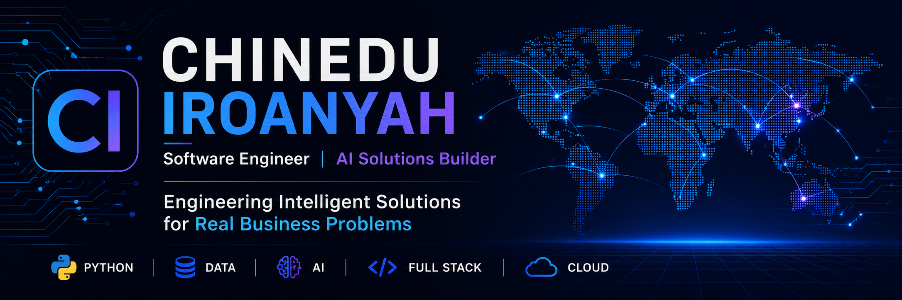

<p align="center">
  
</p>

<h1 align="center">Hi 👋 I'm Chinedu Iroanyah</h1>

<h3 align="center">
Software Engineer | AI Solutions Builder
</h3>

<p align="center">
Engineering Intelligent Solutions for Real Business Problems
</p>

---

# 🚀 About Me

I'm a Computer Science graduate from **Anglia Ruskin University, Cambridge (UK)**, currently based in Abuja, Nigeria.

My background spans software development, data analytics, customer operations technology, business process outsourcing (BPO), and web development.

I'm currently transitioning into an **AI-powered Full-Stack Software Engineer**, building intelligent software that helps organizations automate workflows, analyze data, and improve decision-making.

I believe software engineering is about more than writing code—it's about creating solutions that deliver measurable business value.

---

# 🎯 Current Focus

- 🐍 Mastering Python for backend development and AI
- 🌐 Building Full-Stack applications
- 🤖 Artificial Intelligence & Machine Learning
- ☁ Cloud-native software development
- 📊 Business analytics & automation

---

# 💻 Tech Stack

<p align="center">


</p>

---

# 🟢 Currently Building

- 🐍 Python CSV Analytics Toolkit
- 🌐 Voixone Website Improvements
- 🤖 AI Customer Support Assistant
- 📊 Python Business Dashboard
- ⚙ AI Automation Projects

---

# 📚 Current Sprint

### Week 1

- ✅ Python Fundamentals Refresh
- ✅ Dictionaries
- ✅ Functions
- ✅ File Handling
- ⏳ Object-Oriented Programming
- ⏳ Git Workflow

---

# 🗺 Engineering Roadmap

```text
Computer Science (UK)
          │
          ▼
Data Analytics
          │
          ▼
Python Development
          │
          ▼
Backend Engineering
          │
          ▼
Full-Stack Development
          │
          ▼
Artificial Intelligence
          │
          ▼
Building Intelligent Business Systems
```

---

# 🚀 Featured Projects

## 🌐 Voixone Website

Corporate website redesign focused on improving customer engagement and business presentation.

**Tech**

WordPress • PHP • JavaScript

---

## 📊 Data Analytics Portfolio

Business intelligence projects completed during the Google Data Analytics Professional Certificate.

**Tech**

SQL • Excel • R • Tableau

---

## 🐍 Python Projects

A growing collection of Python projects documenting my transition into AI engineering.

---

# 📈 GitHub Statistics

<p align="center">


</p>

<p align="center">


</p>

---

# 📈 2026 Goals

- Build 10 production-quality software projects
- Contribute to Open Source
- Participate in Kaggle competitions
- Master Python
- Learn FastAPI
- Learn React
- Learn Docker & Cloud Deployment
- Build AI-powered business applications
- Secure a remote Software Engineering role

---

# 🌍 Areas of Interest

- Artificial Intelligence
- Machine Learning
- Backend Engineering
- Full-Stack Development
- Data Engineering
- Cloud Computing
- Business Automation
- Customer Operations Technology

---

# 💡 Engineering Philosophy

> Technology is most powerful when it solves real business problems.

Every repository on this profile reflects my commitment to:

- Building practical solutions
- Writing maintainable code
- Learning continuously
- Sharing knowledge
- Delivering measurable value

---

# 👨‍💻 Currently Learning

- Python
- FastAPI
- React
- Docker
- Machine Learning
- AI APIs
- System Design
- Cloud Engineering

---

# 📫 Let's Connect

<p align="center">

<a href="https://github.com/chinedudeoracle">
GitHub
</a>

•

LinkedIn *(Coming Soon)*

•

Portfolio Website *(Coming Soon)*

</p>

---

<p align="center">

⭐ Thanks for visiting my GitHub!

I'm documenting my journey from Computer Science graduate to AI-powered Full-Stack Software Engineer—one project at a time.

</p>
